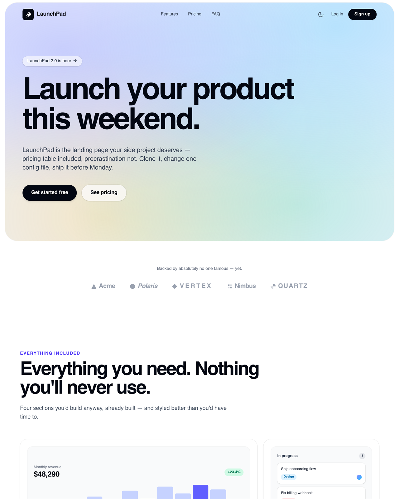

# 🚀 LaunchPad — Free SaaS Landing Page Template

**A production-ready SaaS landing page template built with Next.js 15, TypeScript, and Tailwind CSS v4.** The landing page your side project deserves — hero, features, pricing, FAQ, dark mode, the lot. Clone it, edit one config file, deploy for free. Live before Monday.

**[Live demo →](https://pixelandoak-launchpad.pages.dev)**
**[Template page →](https://pixelandoak.com/templates/saas-landing-page-template/)**



## Why LaunchPad?

Most free templates look free. LaunchPad is built to the standard of a $99 premium template — the kind you'd buy, then spend a weekend ripping the branding out of. We skipped that step for you.

- 🎨 **Signature gradient hero** — a soft mesh-gradient container inset from the viewport edges, Radiant-style, with a massive tracking-tight headline
- 🧱 **Bento feature grid** — analytics chart, kanban board, message thread, and settings toggles, all drawn in pure CSS (zero images, zero icon libraries)
- 🖥️ **CSS-drawn product screenshot** — a full dashboard mock inside a browser frame, built entirely from divs. Swap in a real screenshot later — or don't
- 💰 **Pricing with monthly/annual toggle** — three tiers, elevated "Most popular" dark card, "2 months free" badge on annual
- 💬 **Testimonial masonry grid** — six cards with gradient avatar initials, one accent card for spice
- ❓ **Accessible FAQ accordion** — native `<details>`/`<summary>`, works with zero JavaScript
- 🌙 **Real dark mode** — class strategy, navbar toggle, localStorage persistence, OS-preference detection, and a no-flash inline script. Every section tuned for both themes
- ✨ **Tasteful motion** — CSS-only fade-up reveals via a tiny IntersectionObserver hook. No animation libraries. Respects `prefers-reduced-motion`
- ⚙️ **One-file customization** — every word on the page lives in `config/site.ts`
- 📦 **Fully static export** — `npm run build` emits plain HTML/CSS/JS in `/out`. Host it anywhere, for free
- 🔍 **SEO-ready** — Metadata API, Open Graph tags, robots.txt
- 📱 **Responsive everywhere** — mobile nav panel, fluid type scale, tested from 375px up

## Quick Start

```bash
# 1. Clone the template
git clone https://github.com/haider484991/launchpad-nextjs-saas-template.git my-landing-page
cd my-landing-page

# 2. Install dependencies
npm install

# 3. Start the dev server
npm run dev
```

Open [http://localhost:3000](http://localhost:3000) and start editing. The page hot-reloads as you save.

```bash
# Build the static site (outputs to /out)
npm run build

# Preview the production build locally
npm run preview
```

## Customization

### 1. All content lives in `config/site.ts`

You should never need to edit a component to change copy. Everything is typed, so your editor autocompletes the structure:

| Key            | Controls                                                        |
| -------------- | --------------------------------------------------------------- |
| `name`         | Brand name (navbar wordmark, footer, page title)                |
| `url`          | Canonical URL used in metadata and Open Graph tags              |
| `title` / `description` | `<title>` tag and meta description                     |
| `nav`          | Nav links, log-in link, sign-up button                          |
| `hero`         | Announcement pill, headline, subline, both CTAs                 |
| `logoCloud`    | Tagline + list of company names                                 |
| `features`     | Section heading + bento cards (title, description, visual type) |
| `screenshot`   | Heading copy + the fake URL shown in the browser frame          |
| `testimonials` | Six quote cards (quote, name, title, initials, accent flag)     |
| `pricing`      | Heading, annual badge text, three tiers with feature lists      |
| `faq`          | Six question/answer pairs                                       |
| `finalCta`     | Closing headline, subline, CTA                                  |
| `footer`       | Tagline, four link columns, attribution link                    |

Each feature card picks its CSS-drawn visual with the `visual` key: `"chart"`, `"kanban"`, `"messages"`, or `"toggles"`. Set `wide: true` to make a card span two columns.

### 2. Changing the gradient

The hero and final CTA share one mesh gradient, defined once in `app/globals.css` as `.gradient-mesh` — five layered `radial-gradient`s over a soft base color, with a deeper variant for dark mode. Swap the RGBA colors to re-theme the entire template in seconds. Tip: keep opacities in the 0.2–0.4 range so it stays airy rather than neon.

### 3. Changing the accent color

The accent is Tailwind's `indigo` palette, used in section eyebrows, the pricing toggle, check icons, and the accent testimonial card. Search the `components/` folder for `indigo` and replace with any Tailwind color (`violet`, `sky`, `emerald`…) for an instant rebrand.

### 4. Swapping the logo

The rocket mark and wordmark live in `components/Logo.tsx`. Replace the inline SVG with your own mark and you're done — it updates in the navbar and footer together.

## Deployment

The build is fully static (`output: 'export'`), so it runs on any static host — no Node server required.

### Cloudflare Pages

1. Push your repo to GitHub
2. In the Cloudflare dashboard: **Workers & Pages → Create → Pages → Connect to Git**
3. Build command: `npm run build` — Build output directory: `out`
4. Deploy. Free SSL, global CDN, unlimited bandwidth on the free plan

### Vercel

1. Push your repo to GitHub
2. **Import project** on [vercel.com](https://vercel.com) — Next.js is auto-detected
3. Deploy. The static export is served from Vercel's edge network

### Netlify

1. Push your repo to GitHub
2. **Add new site → Import an existing project**
3. Build command: `npm run build` — Publish directory: `out`
4. Deploy

### Anywhere else

`npm run build`, then upload the `out/` folder to GitHub Pages, S3 + CloudFront, or any web server that can serve files.

## Project structure

```
launchpad-saas-template/
├── app/
│   ├── layout.tsx        # Root layout, metadata, no-flash theme script
│   ├── page.tsx          # The landing page (composes all sections)
│   ├── globals.css       # Tailwind, mesh gradient, reveal animation
│   └── thanks/           # Post-signup placeholder page
├── components/
│   ├── Logo.tsx          # Rocket mark + wordmark
│   ├── Reveal.tsx        # IntersectionObserver fade-up wrapper
│   ├── ThemeToggle.tsx   # Light/dark switch
│   └── sections/         # Navbar, Hero, Features, Pricing, FAQ…
├── config/
│   └── site.ts           # ← ALL page content. Start here.
└── public/
    └── robots.txt
```

## License & attribution

MIT licensed — free for personal and commercial use, no attribution required.

The footer ships with a small "Built by Pixel & Oak" link. You're welcome to remove it, but leaving it in helps us justify making more free templates.

---

Built by [Pixel & Oak](https://pixelandoak.com/templates/saas-landing-page-template/) — we build fast, SEO-ready websites. If you'd rather ship your product while someone else ships your website, [say hello](https://pixelandoak.com/templates/saas-landing-page-template/).
